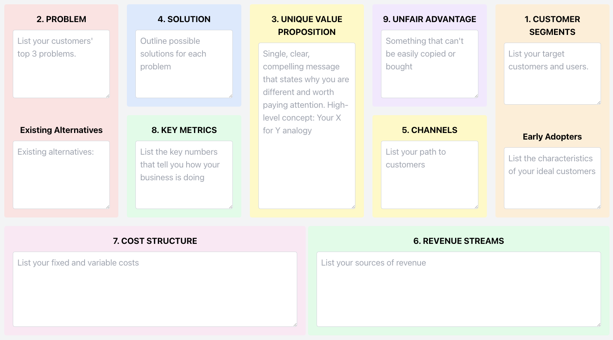

# Lean Canvas App

A powerful tool for entrepreneurs and startups to create and manage their Lean Canvas business models.

## Features

- Create and edit Lean Canvas models
- Save/Load multiple canvases for different business ideas
- Export canvases as image files

## Getting Started

### Prerequisites

- Node.js (v14 or later)
- npm (v6 or later)

### Installation

1. Clone the repository:

git clone https://github.com/brucechou1983/lean-canvas-app.git

2. Navigate to the project directory:

cd lean-canvas-app

3. Install dependencies:

npm install

4. Start the development server:

npm start

5. Open [http://localhost:3000](http://localhost:3000) to view the app in your browser.

## License

This project is licensed under the MIT License - see the [LICENSE](LICENSE) file for details.

## Learn More

To learn more about the Lean Canvas methodology, check out [Lean Stack](https://leanstack.com/lean-canvas).

## Support

If you encounter any issues or have questions, please file an issue on our [GitHub issue tracker](https://github.com/brucechou1983/lean-canvas-app/issues).

Happy business modeling!
